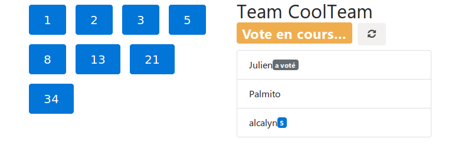
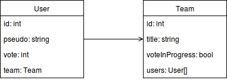

Creating a poker planning application with PHP and websockets
=============================================================



There is already multiple poker planning applications using websockets on Github:
 - https://github.com/WASdev/sample.planningpoker (JAVA)
 - https://github.com/WayneYe/ScrumPoker (Javascript)
 - https://github.com/dctse/ScrumPoker (Javascript)
 - https://github.com/simbo1905/sprint-planning (Scala)
 - https://github.com/qJake/planning-poker (C#)
 - https://github.com/richarcher/Hatjitsu (Javascript)
 - https://github.com/inovex/planning-poker (Javascript)

Written in Javascript (and nodejs in many cases), JAVA, Scala, C#... and no one in PHP, or at least not at the first places.

But does it means that PHP is not able to make a websocket application ?

I often hear that PHP is not good for websockets, that it's better to use nodejs blablabla

In fact, if I want to build a real-time application,
I don't care about using PHP or nodejs, or using websockets or something like long-polling...

But if you are already in a PHP eco-system, or if you love PHP, you may want to build a PHP application.

I'm not saying that PHP is a secondary choice, "because I don't have the choice",
but this article will proove that it is possible to build a real time application using websockets over PHP,
and also to have a structured code, and not only a `websocket-server.php` file.
I will show you how to do it with Sandstone.
This library extends Silex, so if you know Silex, you know already the half part of this tuto (the RestApi part).
But Sandstone also add websockets support, it uses ZMQ, ReactPHP, Ratchet, WAMP protocol,
and provide some abstraction tools to add websocket topics the more simple way, or the more "Silex way".


## What are the application needs

My need is to build a planning poker application, where we can start a poker session, let teammates join it, and let them vote.

So, in a first part, I will build a RestApi with resources:

 - `/teams`: create a team, get a list of existing teams, join a team
 - `/users`: create an user with a pseudo, make an user vote (1, 2, 3, 5, 8, ...).

Then, I will build the second part of the application, the real time vote using websockets.

> I mean by *real time vote* the fact by once an user votes,
> all others user interfaces will be updated instantly:
> the user send the vote information to the server,
> and the server send the vote information to others users once it receives it
> (no Ajax request every seconds).

## Technical stack

- Server:
    - Sandstone:
        - RestApi: create/join rooms
        - Websocket server: be notified when someone join our team, vote, or team vote is finished to refresh the view in real-time.
- Client:
    - Bootstrap 4 + jQuery + Js app which uses api


## Part I: Rest Api with Silex

If you know Silex, you already know this part.
We use Silex to build a light RestApi which handle the `/teams` and `/users` resources.

> [Silex](http://silex.sensiolabs.org/) is a microframework which allows to mount a web application easily,
> with a light router, a light service container ([Pimple](http://pimple.sensiolabs.org/))...

### Install Sandstone

Let's bootstrap a Silex application, but not from scratch.

I will use here the [fullstack version of Sandstone](https://github.com/eole-io/sandstone-fullstack).

Sandstone is a Silex with websockets.
Sandstone fullstack is a skeleton with Doctrine, JMS Serializer, web profiler...

Using Docker, following the documentation:

``` php
git clone https://github.com/eole-io/sandstone-fullstack.git
cd sandstone-fullstack/

docker-compose up --no-deps -d php-fpm database

docker exec -ti sandstone-php /bin/bash -c "composer update"
docker exec -ti sandstone-database /bin/bash -c "mysql -u root -proot -e 'create database sandstone;'"
docker exec -ti sandstone-php /bin/bash -c "bin/console orm:schema-tool:create"

docker-compose up -d
```

> Docker helps us to mount our application web server, websocket server, ...
> so we don't have to install all that stuff.

Let's check that it's well installed by going to
[http://localhost:8088/index-dev.php/api/hello](http://localhost:8088/index-dev.php/api/hello)
(the hello world example).

I also have an access to the **Symfony web profiler** here http://localhost:8088/index-dev.php/_profiler.


Let's clean the HelloWorld example by removing it with `rm -fr src/App/*`,
and empty all the three `registerUserProviders()` methods in:

 - `app/Application.php`
 - `app/RestApiApplication.php`
 - `app/WebsocketApplication.php`


### The Sandstone fullstack structure

The fullstack has in fact 2 stacks:

 - The **RestApi** stack (`app/RestApiApplication`),
 - The **websocket** stack (`app/WebsocketApplication`).

These 2 stacks extend a **common stack** (`app/Application`).

By this way, we do not load RestApi controllers in the websocket server,
and we do not load websocket topics in RestApi stack.

#### The common stack

Contains all stuff needed in both Restapi and websocket stack. Here will be:

 - services,
 - Doctrine mappings,
 - serializer metadata...


#### The RestApi stack

Contains:

 - controllers,
 - converters,
 - also register events to forward to websocket stack because it must not be done in websocket stack.


#### The websocket stack

Contains:

 - websocket topics.


### My PokerPlanning app

Let's create my application in `src/App`.

Silex provides a way to "bundle" services and controllers by using service providers
(`Pimple\ServiceProviderInterface`).

So I create and register 3 providers in `src/App/`,
this is the Silex way to register services and controllers in a Silex application:

#### Common stack

`src/App/PokerPlanningProvider.php`:

``` php
namespace App;

use Pimple\ServiceProviderInterface;
use Pimple\Container;

class PokerPlanningProvider implements ServiceProviderInterface
{
    /**
     * {@InheritDoc}
     */
    public function register(Container $app)
    {
        $app->extend('doctrine.mappings', function ($mappings, $app) {
            $mappings []= [
                'type' => 'yml',
                'namespace' => 'App\\Entity',
                'path' => $app['project.root'].'/src/App/Resources/doctrine',
                'alias' => 'App',
            ];

            return $mappings;
        });
    }
}
```

`app/Application.php`:

``` php
    private function registerUserProviders()
    {
        $this->register(new App\PokerPlanningProvider());
    }
```

#### RestApi stack

`src/App/PokerPlanningRestApiProvider.php`:

``` php
namespace App;

use Pimple\ServiceProviderInterface;
use Pimple\Container;

class PokerPlanningRestApiProvider implements ServiceProviderInterface
{
    /**
     * {@InheritDoc}
     */
    public function register(Container $app)
    {
    }
}
```

`app/RestApiApplication.php`:

``` php
    private function registerUserProviders()
    {
        $this->register(new App\PokerPlanningRestApiProvider());
    }
```

#### Websocket stack

`src/App/PokerPlanningWebsocketProvider.php`:

``` php
namespace App;

use Pimple\ServiceProviderInterface;
use Pimple\Container;

class PokerPlanningWebsocketProvider implements ServiceProviderInterface
{
    /**
     * {@InheritDoc}
     */
    public function register(Container $app)
    {
    }
}
```

`app/WebsocketApplication.php`:

``` php
    private function registerUserProviders()
    {
        $this->register(new App\WebsocketApplication());
    }
```


### Create database schema with Doctrine

The basic scenario is:

The user enters his pseudo, then see the list of the teams.
He selects a team, then see the users and can vote.



So let's create `User` and `Team` entities with Doctrine, in yaml format:

`src/App/Resources/doctrine/App.Entity.User.dcm.yml`:
``` yaml
App\Entity\User:
    type: entity
    repositoryClass: App\Repository\UserRepository
    id:
        id:
            type: integer
            generator:
                strategy: AUTO
    fields:
        pseudo:
            type: string
        vote:
            type: smallint
            nullable: true
    manyToOne:
        team:
            targetEntity: Team
            reversedBy: users
```

`src/App/Resources/doctrine/App.Entity.Team.dcm.yml`:
``` yaml
App\Entity\Team:
    type: entity
    repositoryClass: App\Repository\TeamRepository
    id:
        id:
            type: integer
            generator:
                strategy: AUTO
    fields:
        title:
            type: string
        voteInProgress:
            type: boolean
    oneToMany:
        users:
            targetEntity: User
            mappedBy: team
```

> **Note**:
> I use the yaml format so I can use the Doctrine `orm:generate-entities`
> command from yaml files.
>
> If I had used annotations, I needed to create the entities classes by hand... I don't want to!

Then auto generate entities, and update the database schema:

``` bash
docker exec -ti sandstone-php /bin/bash -c "bin/console orm:generate-entities src/"
docker exec -ti sandstone-php /bin/bash -c "bin/console orm:schema-tool:update --force"
```

You should see the generated entities in `src/App/Entity/`,
and the tables in your phpmyadmin interface (if you use `docker-compose` with default configuration,
go to [http://localhost:8090/](http://localhost:8090/)).


### Create Rest controllers

We now want a lot of routes such as:
 - `POST /users` route when a new user comes and enter his pseudo,
 - `GET /teams` for the teams list,
 - `PUT /teams/{team}/users/{user}` when an user joins a team,
 - `POST /users/{user}/vote` to allow a player vote...

#### Team controller

I won't expose all controllers, but just one as an example.

Let's implement the `POST /users/{user}/vote` route:

`src/App/Controller/UserController.php`

``` php
namespace App\Controller;

use Pimple\Container;
use Symfony\Component\HttpKernel\Exception\BadRequestHttpException;
use Symfony\Component\HttpKernel\Exception\ConflictHttpException;
use Symfony\Component\HttpFoundation\Request;
use Symfony\Component\HttpFoundation\Response;
use Alcalyn\SerializableApiResponse\ApiResponse;
use DDesrosiers\SilexAnnotations\Annotations as SLX;
use App\Entity\User;
use App\Event\UserEvent;

/**
 * @SLX\Controller(prefix="/api")
 */
class UserController
{
    /**
     * @var Container
     */
    private $container;

    /**
     * @param Container $container
     */
    public function __construct(Container $container)
    {
        $this->container = $container;
    }

    /**
     * Vote. Vote number must be in body, and number in Fibonacci sequence.
     *
     * @SLX\Route(
     *      @SLX\Request(method="POST", uri="/users/{user}/vote"),
     *      @SLX\Convert(variable="user", callback="app.converter.user:convert")
     * )
     *
     * @param Request $request
     * @param User $user
     *
     * @throws BadRequestHttpException If vote is not in Fibonacci sequence.
     * @throws ConflictHttpException When trying to vote once the team has finished voting.
     *
     * @return ApiResponse
     */
    public function postVote(Request $request, User $user)
    {
        $pokerPlanning = $this->container['app.poker_planning'];
        $vote = intval($request->getContent());
        $team = $user->getTeam();

        if (!$pokerPlanning->isVoteFibonacci($vote)) {
            throw new BadRequestHttpException('Vote must be in Fibonacci sequence.');
        }

        if (!$team->getVoteInProgress()) {
            throw new ConflictHttpException('Cannot vote now, votes are closed.');
        }

        $user->setVote($vote);

        if ($pokerPlanning->hasTeamVoted($team)) {
            $team->setVoteInProgress(false);
        }

        $this->container['orm.em']->persist($user);
        $this->container['orm.em']->flush();

        return new ApiResponse(null, Response::HTTP_NO_CONTENT);
    }
}
```


### Tiny controllers, thanks to converters

I don't want to do a `->getRepository('Team')->findById($id)` in my controllers.

So I can use converters (see [Silex converters](http://silex.sensiolabs.org/doc/2.0/usage.html#route-variable-converters)).

For example, `src/App/Converter/TeamConverter.php`:

``` php
namespace App\Converter;

use Symfony\Component\HttpKernel\Exception\NotFoundHttpException;
use App\Repository\TeamRepository;

class TeamConverter
{
    /**
     * @var TeamRepository
     */
    private $teamRepository;

    /**
     * @param TeamRepository $teamRepository
     */
    public function __construct(TeamRepository $teamRepository)
    {
        $this->teamRepository = $teamRepository;
    }

    public function convert($id)
    {
        $team = $this->teamRepository->find($id);

        if (null === $team) {
            throw new NotFoundHttpException('Team not found.');
        }

        return $team;
    }
}
```

Then I magically get my instances in my controllers from arguments when I do:

``` php
    /**
     * Make an user joins a team.
     *
     * @SLX\Route(
     *      @SLX\Request(method="PUT", uri="/teams/{team}/users/{user}"),
     *      @SLX\Convert(variable="team", callback="app.converter.team:convert"),
     *      @SLX\Convert(variable="user", callback="app.converter.user:convert")
     * )
     *
     * @param Team $team
     * @param User $user
     *
     * @return ApiResponse
     */
    public function addUser(Team $team, User $user)
    {
        $team->addUser($user);
        $user->setTeam($team);

        $this->container['orm.em']->persist($team);
        $this->container['orm.em']->flush();

        return new ApiResponse($team, Response::HTTP_OK);
    }
```

where `app.converter.team:convert` and `app.converter.user:convert`
are callbacks to the `convert` method in TeamConverter and UserConverter.

Sure, converters need to be registered first as a service in RestApi stack:

`src/App/PokerPlanningRestApiProvider.php`

``` php
        $app['app.converter.team'] = function () use ($app) {
            return new TeamConverter($app['orm.em']->getRepository('App:Team'));
        };

        $app['app.converter.user'] = function () use ($app) {
            return new UserConverter($app['orm.em']->getRepository('App:User'));
        };
```


### Move some logic from controller to service

As you know, business logic should be in services.

The service `app.poker_planning` contains some logic relative to Poker Planning voting.

`src/App/Service/PokerPlanning.php`:

``` php
namespace App\Service;

use App\Entity\Team;

class PokerPlanning
{
    /**
     * Check is a vote is in Fibonacci sequence.
     *
     * @param int $vote
     *
     * @return boolean
     */
    public function isVoteFibonacci($vote)
    {
        return in_array($vote, [1, 2, 3, 5, 8, 13, 21, 34]);
    }

    /**
     * Check whether all users voted.
     *
     * @param Team $team
     *
     * @return boolean
     */
    public function hasTeamVoted(Team $team)
    {
        foreach ($team->getUsers() as $user) {
            if (null === $user->getVote()) {
                return false;
            }
        }

        return true;
    }
}
```

Let's register the service in common stack:

In `src/App/PokerPlanningProvider.php`:
``` php
        $app['app.poker_planning'] = function () {
            return new PokerPlanning();
        };
```


## Part II: Create websocket topics to notify clients from Api state changes

Well, we now have a working RestApi where we can list all users and their vote in a team.

Now I want to display which user has voted in real-time.

But I don't want to request my RestApi every second to check if state has changed.

I want the RestApi notify me when an user votes and when all users voted
so I can display informations as soon as it is available.


### Display user vote in real time

How we will achieve that ?

The logic is:

1. Someone votes, then calls `PUT /teams/1/users/1`.
1. The RestApi handles the request,
1. update the user vote,
1. persist to user vote,
1. then sends the response that all is ok.

But I also want that the RestApi notifies all other users in the team that I voted.

So all users will **subscribe** to a websocket,
and the RestApi will notify through this websocket that I voted.

Sandstone uses the WAMP protocol. So instead of listen to the websocket,
we can create channels, or topics, and **subscribe** to a topic.

I will then receive messages from this topic only.

I want to create a topic for each team, `teams/1`, `teams/2`, ...

And I will dispatch messages relative the the team on these channel.

Then, every user who joins a team will also subscribes to the team channel to receive real-time notifications.


#### Creating the websocket topic

A Topic class is responsible of the logic behind a websocket topic.

It implements for example the method `onSubscribe`, called when an user subscribes to this topic.
You probably want to add this user to an array so you know which user are subscribed this specific topic.

It also implements the `onPublish` method, when an user send a message to this topic.
You probably want to broadcast back this message to every users who subscribed to this topic.

It also provides a `broadcast` method to broadcast a message to every subscribing users.

This class is a child of the RatchetPHP Topic class (`Ratchet\Wamp\Topic`).

First create the topic class `src/App/Topic/TeamTopic.php`:

``` php
namespace App\Topic;

use Eole\Sandstone\Websocket\Topic;
use App\Event\UserEvent;

class TeamTopic extends Topic
{
    /**
     * @var int
     */
    private $teamId;

    /**
     * @param string $topicPattern
     * @param int $teamId
     */
    public function __construct($topicPattern, $teamId)
    {
        parent::__construct($topicPattern);

        $this->teamId = $teamId;
    }
}
```

And register the topic in websocket stack, in `src/App/PokerPlanningWebsocketProvider.php`:

``` php
namespace App;

use Pimple\ServiceProviderInterface;
use Pimple\Container;
use App\Topic\TeamTopic;

class PokerPlanningWebsocketProvider implements ServiceProviderInterface
{
    /**
     * {@InheritDoc}
     */
    public function register(Container $app)
    {
        $app
            ->topic('teams/{teamId}', function ($topicPattern, $arguments) {
                $teamId = intval($arguments['teamId']);

                return new TeamTopic($topicPattern, $teamId);
            })
            ->assert('teamId', '\d+')
        ;
    }
}
```

Web client in my team #1 can now subscribe to `teams/1`, but nothing will happens for now.


#### Forward vote event to websocket topic

I want my topic to listen to the `UserEvent::VOTED`.

But this event is dispatched in the RestApi stack whereas my topic is in the websocket stack, this is to different threads.

Sandstone allows to dispatch event from RestApi stack to websocket stack by *forwarding* it.

First, disptach the event from the controller, in `src/App/Controller/UserController.php`:

``` php
namespace App\Controller;

use Symfony\Component\HttpFoundation\Request;
use Symfony\Component\HttpFoundation\Response;
use Alcalyn\SerializableApiResponse\ApiResponse;
use App\Entity\User;
use App\Event\UserEvent;

class UserController
{
    public function postVote(Request $request, User $user)
    {
        // ...

        // Upate the user vote
        $user->setVote($vote);

        // Persist the user
        $this->container['orm.em']->persist($user);
        $this->container['orm.em']->flush();

        // + Add this line, dispatch an event with the user entity
        $this->container['dispatcher']->dispatch(UserEvent::VOTED, new UserEvent($user));

        // Return the RestApi response
        return new ApiResponse(null, Response::HTTP_NO_CONTENT);
    }
}
```

Nothing new here, just dispatching an event using Symfony EventDispatcher.

We want to listen this event from the Topic class.
We need to forward the event with:

`src/App/PokerPlanningRestApiProvider.php`:

``` php
namespace App;

use Pimple\ServiceProviderInterface;
use Pimple\Container;
use App\Event\UserEvent;

class PokerPlanningRestApiProvider implements ServiceProviderInterface
{
    /**
     * {@InheritDoc}
     */
    public function register(Container $app)
    {
        // ...

        $app->forwardEventsToPushServer([
            UserEvent::VOTED,
        ]);
    }
}
```

Then magically listen it in the `TeamTopic` class:

> By magically I mean that the event instance is serialized,
> sent to the websocket server thread through a Push server (ZeroMQ),
> then deserialized and redispatched in the websocket server application event dispatcher.
>
> By this way you're able to *magically* listen an event from another PHP thread.

``` php
namespace App\Topic;

use Symfony\Component\EventDispatcher\EventSubscriberInterface;
use Eole\Sandstone\Websocket\Topic;
use App\Event\UserEvent;

class TeamTopic extends Topic implements EventSubscriberInterface
{
    /**
     * {@InheritDoc}
     */
    public static function getSubscribedEvents()
    {
        return [
            UserEvent::VOTED => 'onUserVoted',
        ];
    }

    /**
     * @param UserEvent $event
     */
    public function onUserVoted(UserEvent $event)
    {
        // Check if the event is relative to this team
        if ($event->getUser()->getTeam()->getId() !== $this->teamId) {
            return;
        }

        // Broadcast to every websocket clients
        $this->broadcast([
            'type' => 'user_voted',
            'user' => $event->getUser(),
        ]);
    }
}
```

> **Note**:
> Don't forget to restart the websocket server
> when the source code changed.


Also:
 - about building Full RestApi app, Full websocket app, rest api first, websocket first...
 - Then why not make a full websocket app to make profit from real-time and performance...
 - security flaws when looking into javascript console, problem I avoided in this article, then introduce OAuth with Sandstone...
